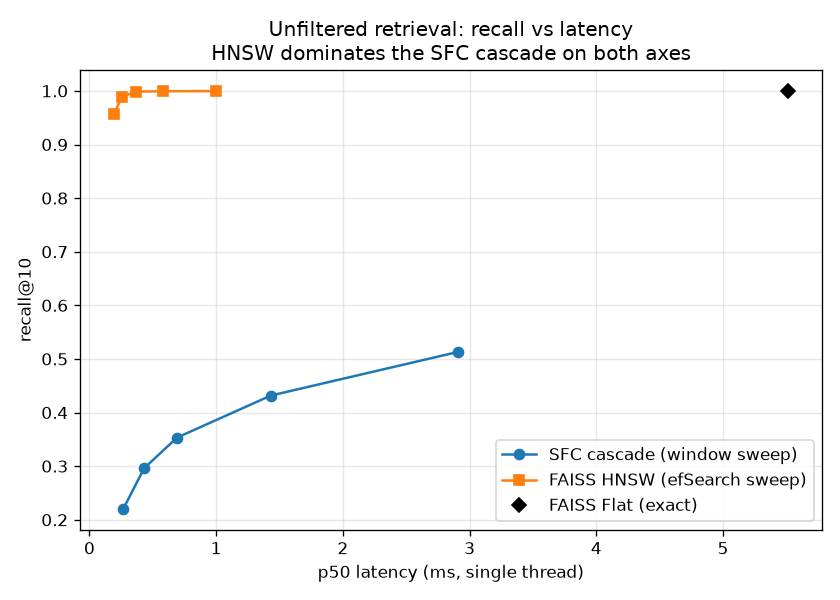
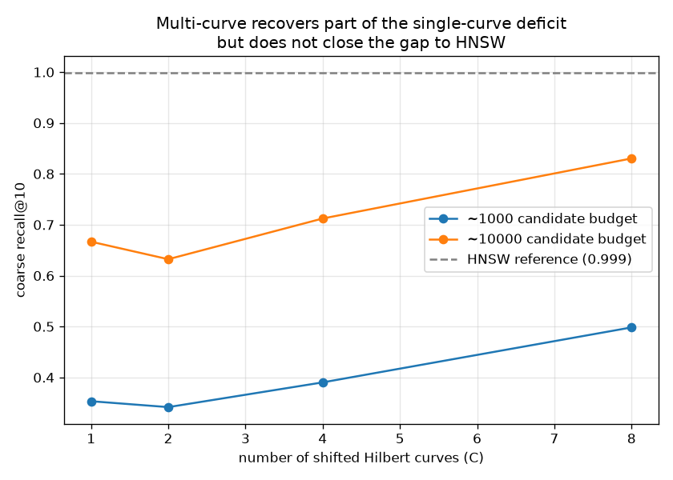
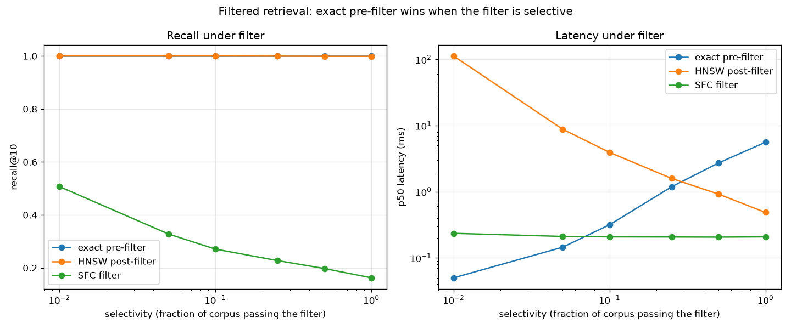
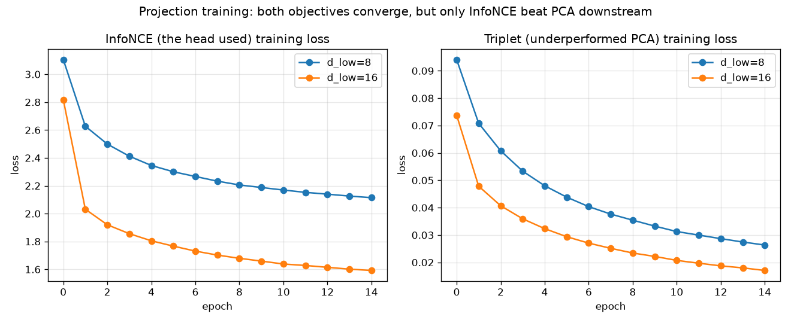

# Hilbert-RAG

A CPU-native RAG retrieval service. Its differentiator is a Hilbert space-filling-curve index built for filtered retrieval, with a trained PyTorch projection that makes the curve viable on semantic embeddings.

Status: built end to end. The retrieval cascade, the trained projection, the benchmark, and a FastAPI service are in place and tested.

## What this is, honestly

This is a leakage-safe benchmark of a space-filling-curve index for dense retrieval, and the headline result is negative. On unfiltered recall FAISS HNSW wins and it is not close. Under a selective metadata filter, exact search over the filtered subset wins on both recall and latency. At this corpus size the curve does not win a retrieval regime, and the benchmark says so plainly.

The value of the project is what it measures and how honestly it does it.

- A trained PyTorch projection feeds the curve measurably better than PCA once the objective is right. An InfoNCE head beats PCA on the candidate-set recall the system actually depends on.
- A multiple-shifted-curve fix is implemented and measured. Eight shifted curves recover a large part of the single-curve deficit while scanning fewer candidates, and they still do not catch HNSW. The benchmark shows exactly how much the fix buys and where it stops.
- The failure is decomposed, not guessed. The projection preserves most of the neighbor structure, and the one-dimensional curve order then discards it. Those two losses are measured separately.
- The index is small and dependency-light, about a hundred lines you can read end to end.

This is a reproduction and extension of a published line of work, HD-Index and Leutenegger and Mokbel, not novel research. Learned projection into a one-dimensional index is also known, for instance LIDER. Saying so is part of what makes the benchmark credible.

The retrieval quality oracle is exact nearest neighbors in embedding space, not human-judged relevance. Every benchmarked number comes from a measurement saved to disk, never a rounded or hoped-for figure.

## Layout

```
src/hilbert_rag/
  embeddings.py   embed the corpus and cache it
  oracle.py       exact nearest-neighbor ground truth, filtered and unfiltered
  sfc_index.py    Hilbert key, sorted array, window query
  cascade.py      coarse candidates then exact rerank
  projection.py   PyTorch MLP head, contrastive loss, hard-negative mining
  baselines.py    FAISS Flat and HNSW wrappers
  filtered.py     metadata predicate and the selectivity sweep
  benchmark.py    metrics and plots
  service.py      FastAPI /search and /ask
tests/            pytest suite
results/          CSV tables and figures, committed
data/             corpus and cached embeddings, gitignored, rebuilt from scripts
```

## Setup

CPU only, Python 3.12, podman for the container build.

```bash
bash scripts/setup-env.sh      # creates .venv (py3.12), installs CPU torch + the rest
source .venv/bin/activate
```

## Running the service

`/search` takes `{query, k, filter?, backend?}` and returns ids and scores. The default backend is FAISS HNSW, with the SFC cascade and exact Flat selectable. `/ask` retrieves and then makes one LLM call, returning an answer with the cited chunk ids.

```bash
# Local, against the real cached index (after building data/ with the scripts):
uvicorn hilbert_rag.service:build_default_app --factory --port 8000

# Container, synthetic demo corpus, no data or token needed:
bash scripts/verify_container.sh
```

Set `HF_TOKEN` to enable `/ask` against the Hugging Face router. Without it, `/ask` returns 503 in real mode and a labelled offline stub in demo mode.

## Results

All numbers are measured and saved under `results/`, and every figure is regenerated from those CSVs by `scripts/make_plots.py`. The oracle is exact cosine nearest neighbors over the full 384-dimensional embeddings, on 300 held-out queries against a 39,700-vector arXiv index. For the SFC cascade, end-to-end recall@k equals coarse recall@k by construction: the rerank is exact and deeper than k, so any true neighbor present in the candidate set is returned, which makes the candidate set the binding ceiling.

### Unfiltered retrieval: HNSW wins



| method | recall@10 | p50 latency |
|--------|-----------|-------------|
| FAISS HNSW, ef=64 | 0.999 | 0.36 ms |
| FAISS Flat, exact | 1.000 | 5.51 ms |
| single-curve SFC, about 10k candidates | 0.667 | 10.6 ms |
| 8-curve SFC, about 10k candidates | 0.830 | 7.65 ms |

HNSW is both higher recall and faster. The SFC cascade is not competitive on plain unfiltered retrieval, and the project says so.

### Multi-curve: shifted curves, measured

A single Hilbert curve splits some neighbors across a recursion boundary, which is why its recall collapses in high dimension. The standard idea is several shifted curves whose candidate windows are unioned; here each curve is a single diagonal offset of the grid with wraparound, a simplified variant of the independent per-axis shifts used in the literature. At a fixed total candidate budget:



| candidate budget | C=1 | C=2 | C=4 | C=8 |
|------------------|-----|-----|-----|-----|
| about 1,000 | 0.353 | 0.342 | 0.390 | 0.498 |
| about 10,000 | 0.667 | 0.632 | 0.712 | 0.830 |

Eight curves lift coarse recall@10 from 0.353 to 0.498 at the small budget and from 0.667 to 0.830 at the large one, while scanning fewer unique candidates than one curve because the windows overlap. The dip at two curves is real: two opposite shifts are too correlated to add coverage while each window halves. Even at eight curves the result stays well below HNSW.

### Filtered retrieval: exact pre-filter wins when the filter bites



Exact search over the filtered subset is exact by construction and gets cheaper as the filter tightens, down to 0.05 ms at one percent selectivity. HNSW post-filtering must over-retrieve to return k matches, so its latency climbs to about 112 ms at one percent. The SFC filter has flat latency near 0.2 ms but its recall stays between 0.16 and 0.51. There is no selectivity where the curve sits on the recall and latency frontier. These SFC filter numbers use the single-curve index for a clean comparison; eight curves would raise them in line with the unfiltered gain but still lose to exact pre-filter, which is exact by definition.

### Projection ablation: the learned head is the best key

At the curve's operating point, d_low = 8 and about a thousand candidates, the InfoNCE projection reaches coarse recall@10 of 0.353, against 0.322 for PCA and 0.151 for a random projection. A triplet objective trained but underperformed PCA, which is why the head uses InfoNCE. The curve-free ceiling diagnostic shows the remaining loss is the one-dimensional ordering, not the projection.



Both objectives converge cleanly. Convergence alone is not the point: the triplet loss fell to near zero and still produced a worse key than PCA, because a margin between mined pairs does not preserve the global cosine order the oracle scores against. InfoNCE, which makes each anchor discriminate its true neighbor against many negatives at once, is what actually beat PCA.

## Where the SFC index wins, where FAISS wins, and what did not work

- FAISS HNSW wins unfiltered retrieval, on both recall and latency. It is the service default.
- Exact pre-filter wins filtered retrieval whenever the filter is selective, on both recall and latency, because the subset is small enough to scan exactly.
- The SFC index wins nothing at this corpus size. Its one honest structural property is a smaller index-structure footprint, and this is an arithmetic bound rather than a runtime measurement: the index is a few integer arrays, on the order of 24 bytes per item for the sorted key, id, and order, against roughly 256 bytes per item for an HNSW graph at M=32 with its 2*M links. The raw vectors dominate total memory regardless, so this is an index-structure statement, not a total-memory one.
- What did not work: a single Hilbert curve loses most neighbor structure in high dimension; a triplet loss was a weak proxy for global cosine order; raising d_low to 16 helped the projection ceiling but hurt the curve; raising the bit depth did nothing because quantization was never the bottleneck.
- What the literature does instead: filtered approximate search at scale now uses range-aware graph indexes such as SeRF and ACORN, not space-filling curves. A corpus-scaling crossover for the curve's flat latency is plausible but unmeasured here, so it stays future work rather than a claim.

## Defending the design

- Why a Hilbert curve preserves neighbors, and where it breaks. Points close on the curve are usually close in space because the curve fills a local region before moving on. It breaks when neighbors land on opposite sides of a recursion boundary, and in high dimension almost every neighbor eventually does, so one curve cannot keep them all adjacent in a single dimension.
- Why not just use FAISS HNSW. I do, as the default. The curve was the studied alternative for the filtered regime where post-filtered HNSW degrades, and the measured result is that exact pre-filter beats both there, so the curve is presented as a studied negative, not a recommendation.
- The projection loses recall, so what is the point. The curve only proposes candidates. The exact rerank in full dimension restores precision over whatever the candidates contain, which is why coarse recall is reported separately as the ceiling.
- Did the learned projection beat PCA. Yes, with InfoNCE, 0.353 against 0.322 coarse recall@10 at d_low = 8. A ranking loss optimizes neighbor order, while PCA only maximizes variance.
- Recall under filtering and how it was measured. The oracle is exact nearest neighbors within the metadata-filtered subset, swept from full selectivity down to one percent, reporting recall and latency at each point.
